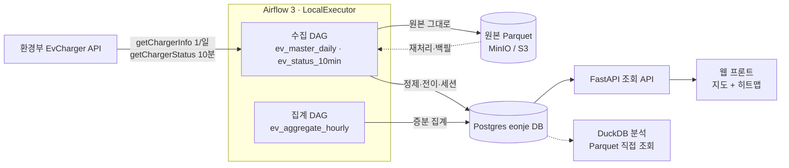
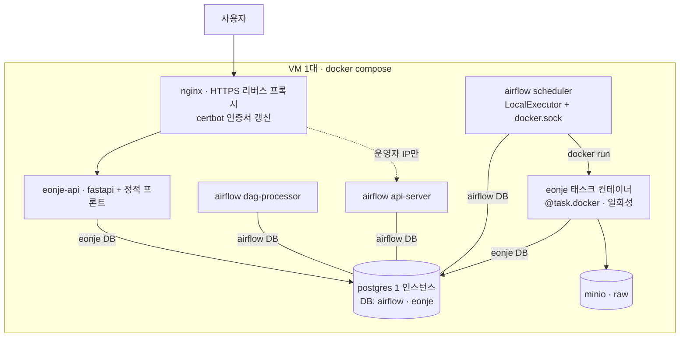

# 언제충전 (eonje) — 설계

EV 충전기 점유 패턴 서비스. 2026.10.09 시작.
서비스명 **언제충전**, 레포·패키지명 **`eonje`**. 요구사항은 [requirements.md](./requirements.md).
공개 API 기반 개인 프로젝트. 구현하면서 이 문서를 갱신한다.

## 1. 서비스 정의

전국 전기차 충전기 상태를 계속 수집해, 공식 데이터가 주지 않는 **이력 기반 정보**를 제공한다.

- 사용자: 전기차 차주
- 핵심 기능 (우선순위 순)
  1. 충전소·충전기별 요일×시간대 점유 패턴 (언제 비는가)
  2. 장기 비정상 충전기 추적 (통신이상·운영중지·점검중이 며칠째 지속)
  3. 시설 유형·지역·운영기관별 점유 통계 (고속도로 휴게소 급속의 주말 오후, 아파트 완속의 야간 등)
  4. 예측 — "지금 가면 비어 있을 확률". 처음엔 같은 요일·시간대 평균(베이스라인), 데이터가 쌓이면 모델
  5. (3단계) 요청 기반 빈자리 알림 — 이력·예측과 결합. 상세는 요구사항 FR-60~63
- 하지 않는 것: 지도 검색·결제·리뷰·상시 감시 알림. 기존 앱(EV Infra, 모두의충전, ChargEV 등)이 이미 함. 차별점은 이력.

## 2. 아키텍처

### 2.1 전체 구조



데이터는 한 방향으로만 흐른다: API → 원본 → 정제 → 집계 → 서빙. 역방향은 원본에서 재처리하는 경로 하나뿐이다.

### 2.2 계층과 책임

| 계층 | 책임 | 하지 않는 것 |
|---|---|---|
| 수집 (ingest) | API 호출, 페이지 순회, 재시도, 호출 예산, 원본 저장 | 파싱·타입 변환·판단 |
| 원본 (raw) | 응답을 받은 그대로 보존. 전 컬럼 문자열. 재처리의 유일한 출발점 | 수정·삭제 |
| 정제 (transform) | 타입 변환, 중복 제거, 차원 SCD2, 전이 계산, 세션 복원, 보정 | API 호출, 외부 I/O (DataFrame in → DataFrame out) |
| 집계 (aggregate) | 요일×시간대 점유, 비정상 지속, 품질 지표. 증분 | 원본 접근 |
| 서빙 (serve) | 집계 테이블 읽기 전용 API | 쓰기, 집계 계산 |
| 오케스트레이션 (Airflow) | 스케줄, 의존성, 재시도, 재실행 | 비즈니스 로직 |

### 2.3 실행 모델 — 태스크는 `eonje` 컨테이너에서

- **Airflow 이미지는 공식 이미지 그대로.** 커스텀 빌드 없음. `dags/`만 마운트. DAG 파일은 `airflow`와 표준 라이브러리만 import
- **`eonje` 이미지 하나**(`python:3.11-slim` + uv 의존성 + 코드)가 파이프라인 태스크와 FastAPI 양쪽에 쓰인다. entrypoint만 다름
- 태스크는 `@task.docker(image="eonje:<tag>", command=["python", "-m", "eonje.cli", "<job>", ...])`. scheduler가 docker socket으로 태스크 컨테이너를 띄운다
- 태스크 간 데이터는 XCom이 아니라 MinIO·DB를 거친다. XCom은 run_id·건수 같은 작은 값만 (`do_xcom_push`)
- 태스크 컨테이너는 compose 네트워크에 붙인다 (`network_mode=<compose network>`) — Postgres·MinIO 접근
- 효과: Airflow와 파이프라인 의존성 완전 분리. "`eonje`는 Airflow 없이 돈다"는 경계가 런타임에서 강제됨. K8s 이전 시 `@task.docker` → `@task.kubernetes`, 이미지 동일
- 비용: scheduler에 `/var/run/docker.sock` 마운트(호스트 root 상당 권한 — 1인 VM에서 감수), 태스크당 컨테이너 기동 수 초(10분 주기엔 무시), 코드 변경 시 `eonje` 이미지 리빌드(수십 초, 태그 = 배포 버전)

### 2.4 모듈 경계 — 레포 구조

```
eonje/
  eonje/                  # 순수 Python 패키지. Airflow를 import하지 않는다
    cli.py                # 태스크 진입점: `python -m eonje.cli <job> --run-id ...`. 각 job은 함수 하나 호출
    config.py             # 설정값 (한도·간격·지역·페이지 크기). 환경변수에서 로드
    client/               # API 클라이언트: 요청 조립, 페이지네이션, 재시도, 응답 검증
    budget/               # 호출 예산: 오늘 사용량 조회, 실행 가능 여부·페이지 상한 판단
    storage/
      raw.py              # Parquet 경로 규칙, 쓰기·읽기
      models.py           # SQLAlchemy ORM 모델 (서비스 DB 스키마의 단일 출처. Alembic autogenerate 대상)
      db.py               # 엔진·세션 팩토리, 대량 upsert 헬퍼 (insert(...).on_conflict_do_update)
    transform/            # 순수 함수. 입력 DataFrame → 출력 DataFrame
      dims.py             # SCD2 비교·갱신 행 생성
      observations.py     # 중복 제거, 타입 변환, 관측 시각 버킷
      transitions.py      # charger_state와 비교 → 전이 이벤트
      sessions.py         # last_ts/last_te/now_ts → 세션 upsert 행
      reconcile.py        # 전체 스냅샷 vs 추적 상태 불일치 → 보정 전이
      aggregate.py        # 점유·비정상·품질 지표
    codes/                # 코드표 (버전별 YAML) + 로더
  api/                    # FastAPI. 집계 테이블 read-only. eonje.storage.models를 그대로 조회
  dags/                   # 얇은 DAG. @task.docker로 eonje.cli 호출만. Airflow 컨테이너에 마운트
    ev_master_daily.py
    ev_status_10min.py
    ev_aggregate_hourly.py
  web/                    # 프론트 (후순위)
  docs/                   # 이 문서들
  Dockerfile              # eonje 이미지 (태스크 + API 공용)
  infra/
    compose.yaml          # nginx, certbot, airflow 공식 이미지(api-server·scheduler·dag-processor), postgres, minio, eonje-api
    postgres/init.sql     # 첫 기동 시 airflow·eonje DB와 역할 생성
    nginx/                # nginx.conf, 사이트 설정
    migrations/           # Alembic — models.py에서 autogenerate, 검토 후 커밋
    .env.example
  tests/
    unit/                 # transform·budget·client 단위 테스트 (Airflow 없이 실행)
    fixtures/             # 실제 API 응답 샘플 (키 제거)
  .github/workflows/
    ci.yml                # ruff, mypy, pytest, eonje 이미지 빌드
```

경계 규칙:
- **Airflow를 아는 코드는 `dags/`뿐.** `eonje`는 Airflow 없이 import·테스트되고, 런타임에서도 별도 컨테이너라 Airflow 패키지가 아예 없다. CLI로 백필할 때도 같은 진입점.
- **외부 I/O를 아는 코드는 `client/`와 `storage/`뿐.** `transform/`은 순수 함수라 fixture로 테스트한다.
- **API 어휘(`statId`, `chgerId`, `stat`…)는 `observations.py`에서 내부 어휘(`stat_id`, `charger_id`, `status_code`)로 한 번 번역**하고, 그 아래로는 내부 어휘만 쓴다. 응답 필드가 바뀌어도 수정 지점은 한 곳.
- 설정값은 `config.py`에서만 읽는다. DAG 스케줄 간격도 거기서 가져온다 (DAG 파일은 환경변수를 직접 읽음 — eonje import 불가).
- **DB 스키마의 단일 출처는 `models.py`.** 파이프라인 적재와 API 조회가 같은 모델을 쓴다. 대량 적재는 ORM 객체 생성 없이 `insert(Model).values(rows).on_conflict_do_update(...)`로 — 행 단위 `session.add`는 금지.

### 2.5 런타임 토폴로지



- 로컬 개발과 클라우드가 같은 compose. 차이는 `.env`(키, 볼륨 경로, MinIO 대신 S3 엔드포인트, docker socket 경로)뿐
- 외부 노출 포트는 nginx의 80/443뿐. FastAPI·Airflow·DB·MinIO는 compose 내부 네트워크
- nginx: `eonje.kr` → eonje-api(+정적 프론트), `airflow.eonje.kr` → Airflow UI(운영자 IP 허용 목록). TLS는 certbot 컨테이너가 Let's Encrypt 발급·자동 갱신(webroot 방식)
- **Postgres는 인스턴스 하나, 데이터베이스 둘**(`airflow`, `eonje`)에 역할도 둘. `init.sql`로 첫 기동 시 생성. Airflow 메타DB를 초기화·교체해도 `eonje` DB는 무관하고, 백업은 DB 단위 `pg_dump`. 인스턴스 분리는 자원 격리가 필요해질 때 — `eonje` DB만 덤프해 옮기면 됨
- 클라우드 이전 시 MinIO → 객체 스토리지(S3 호환)로 엔드포인트만 교체. `storage/raw.py`는 s3fs/pyarrow 경로 추상화로 양쪽을 같은 코드로 다룬다
- 규모가 커져 LocalExecutor로 부족해지면 CeleryExecutor 또는 KubernetesExecutor로 — DAG·eonje 코드 변경 없음

### 2.6 처리 흐름 요약

```
[10분마다]  예산 확인 → period=10 전 페이지 수집 → raw 저장
            → 중복 제거·버킷 → obs_status
            → charger_state와 비교 → evt_transition, charger_state 갱신
            → last_ts/last_te/now_ts → fact_session upsert

[1일 1회]   53페이지 수집 → raw 저장
            → dim_station·dim_charger SCD2
            → 전체 stat vs charger_state → 보정 전이 (source=reconciled)
            → obs_status (source=full)

[매시]      obs·session 증분 → agg_occupancy_hourly, agg_station_hourly
            → agg_abnormal, 품질 지표
```

역할: 10분 수집은 **움직임**(변경분), 일 1회 수집은 **전체 모습과 정답지**(마스터 + 보정), 매시 집계는 **사용자용 요약**. 집계는 API 호출 없음.

## 3. 기술 스택

선택 기준: 1인 운영 가능, 로컬과 클라우드 동일, 학습 비용이 낮을 것, 바꿀 때 한 곳만 바꾸면 될 것.

| 영역 | 선택 | 이유·비고 |
|---|---|---|
| 언어 | Python 3.11 (파이프라인·API), TypeScript (프론트) | |
| 패키지 관리 | uv (`pyproject.toml`, lock) | 설치 빠름. eonje 이미지 빌드에 사용 |
| 오케스트레이션 | Apache Airflow 3.x 공식 이미지, LocalExecutor, TaskFlow `@task.docker` | 커스텀 Airflow 이미지 없음. 3.x REST(JWT)·`run_after` 등 3 기준으로 작성 |
| 태스크 실행 | Docker provider (`@task.docker`), `eonje` 이미지 | Airflow와 파이프라인 의존성 분리. K8s 이전 시 `@task.kubernetes`로 교체 |
| HTTP 클라이언트 | httpx + tenacity | 동기로 충분(페이지 순차). 재시도·백오프는 tenacity |
| 설정 | pydantic-settings | 환경변수 → 타입 검증된 설정 객체. `config.py` 하나 |
| 데이터 처리 | pandas + pyarrow | 하루 수백만 행 수준이라 충분. 병목 생기면 `transform/`만 polars로 교체 가능 |
| 원본 저장 | Parquet (pyarrow), MinIO → S3 호환 객체 스토리지 | 경로는 s3fs로 추상화. 로컬은 MinIO |
| 서비스 DB | PostgreSQL 16 (1 인스턴스, `airflow`·`eonje` 2 DB), SQLAlchemy 2 ORM (Declarative, `Mapped[]`), psycopg 3, Alembic | 모델이 스키마·마이그레이션·API 조회의 단일 출처. 대량 적재는 ORM 세션 대신 dialect `insert ... on_conflict_do_update`. 동기 세션 |
| 분석 | DuckDB | Parquet 직접 조회, 검증·탐색용. 서빙 경로에는 안 씀 |
| API | FastAPI, pydantic v2, uvicorn | `/v1/` 버전 고정. 응답 스키마 = 프론트·모바일 공통 계약. ORM 모델 → pydantic 응답 모델 변환은 `from_attributes` |
| 프론트 | React + TypeScript + Vite | 반응형. API만 호출, 로직 없음 |
| 지도 | Kakao Maps JS SDK | 국내 지도 품질·무료 쿼터. 모바일은 네이티브 SDK로 교체, 데이터는 동일 |
| 차트 | Apache ECharts | 히트맵 내장. 7×24 격자 |
| 리버스 프록시·TLS | nginx + certbot (Let's Encrypt) | 80/443만 노출. 인증서는 certbot 컨테이너가 자동 갱신. Airflow UI는 IP 허용 목록 |
| 컨테이너 | Docker, docker compose | 로컬 = 클라우드. 빌드 대상은 `eonje` 이미지 하나 |
| 클라우드 | 소형 VM 1대 + S3 호환 스토리지 (업체 미정) | 비용 기준으로 선택. compose 그대로 |
| 테스트 | pytest, 실제 응답 fixture | `transform/`은 fixture만으로 100% 커버 목표. DB 테스트는 Actions `services:` Postgres |
| 품질 | ruff (lint·format), mypy, pre-commit | |
| CI | GitHub Actions | ruff + mypy + pytest + `eonje` 이미지 빌드. 첫 커밋부터 |
| CD | 처음엔 수동 (`git pull && docker compose build eonje && up -d`). 배포가 잦아지면 GHCR push + SSH `compose pull` job | VM `.env`는 서버에만. Actions secrets는 SSH 키만 |
| 알림·관측 | 텔레그램 봇 (운영자 통지), Airflow UI | Prometheus/Grafana는 필요해지면 — 1인 운영에 과함 |
| 시크릿 | `.env` (로컬), Airflow Connection/Variable | 레포에 넣지 않음. `.env.example`만 커밋 |

보류한 것: Kubernetes(1대 VM에 과함), Celery/Redis(LocalExecutor로 충분), dbt(SQL 변환이 적고 Python 순수 함수로 충분), Kafka 등 스트리밍(10분 배치면 됨), async SQLAlchemy(읽기 전용 API에 이득 적음, 필요 시 API만 전환), Caddy/Traefik(nginx가 범용), 커스텀 Airflow 이미지 + 코드 마운트(`@task.docker`로 대체 — 의존성 분리가 더 깨끗), Postgres 인스턴스 분리(DB 분리로 충분).

## 4. 데이터 소스

한국환경공단 "전기자동차 충전소 정보" OpenAPI (공공데이터포털, 서비스 `B552584/EvCharger`). 활용가이드 v1.25 (2026.07.01). 개발계정 **일 1,000회**.

Base: `https://apis.data.go.kr/B552584/EvCharger/`

| 오퍼레이션 | 용도 | 주요 파라미터 | 응답 |
|---|---|---|---|
| `getChargerInfo` | 충전기 마스터 + 현재 상태 | `zcode`, `zscode`, `kind`, `kindDetail`, `statId`, `chgerId` | 40여 필드 |
| `getChargerStatus` | 상태만 (경량) | `period`(분, 1~10, 기본 5) + 위 필터 | `busiId statId chgerId stat statUpdDt lastTsdt lastTedt nowTsdt` |

공통: `serviceKey`, `pageNo`, `numOfRows`(10~9,999), `dataType=JSON`. 응답 `resultCode`, `totalCount`, `items.item[]`.

### 실측 (2026.10.09 금 14:00~14:20 KST)

| 호출 | totalCount | 비고 |
|---|---|---|
| `getChargerInfo` 전체 | **526,239** | 9,999건씩 53페이지 |
| `getChargerInfo zcode=11` (서울) | **76,005** | 14.5%, 8페이지 |
| `getChargerStatus period=10` | **13,668** | 전국의 2.6%, 2페이지 |
| `getChargerStatus period=1` | **0** | 비정상. 상류 배치 반영 지연 또는 하한 미준수로 추정. 짧은 period 사용 안 함 |

### 필드에서 확인된 사실

- `statUpdDt`는 운영기관마다 의미가 다르다. 환경부(ME) 충전기는 상태 변화 없이도 15분쯤마다 갱신됨(주기 보고). 전체 2.6%만 10분 내 갱신이므로 다른 기관은 변경 시만 올리는 것으로 보임. → **전이 시각으로 쓰지 않는다.** 관측으로 저장하고 전이는 직전 상태와 비교해 계산.
- 실제 전이도 잡힌다: `stat=3`이 되며 `nowTsdt`와 `statUpdDt`가 1초 차이로 기록됨.
- `lastTsdt`/`lastTedt`(마지막 충전 시작·종료)가 충실히 채워짐. 전이를 놓쳐도 충전기별 마지막 세션은 복원 가능. 50kW 급속 세션은 대략 20~40분.
- `nowTsdt`는 충전 중일 때만 값이 있음.
- `statId`는 숫자 8자리가 아니라 `ME174013`처럼 기관 코드 접두 문자열.
- `maker`(제조사) 필드가 문서에 없는데 옴. `powerType`은 빈 값. → 원본은 가공 없이 저장.
- 상태 코드가 문서 두 곳에서 다름. 필드 설명: 0 알수없음 / 1 통신이상 / 2 사용가능 / 3 충전중 / 4 운영중지 / 5 점검중. 공통코드표: 2 충전대기, 6 예약중, 9 상태미확인 추가. → enum 고정 금지. 미지 코드도 저장, 집계 시 매핑.
- 요청 명세에 `statId`·`chgerId`가 필수로 표기돼 있으나 없어도 호출됨 (표기 오류).
- 정렬이 기관·등록 순이라 한 페이지로 분포 추정 불가.
- 지역 코드가 2026년에도 계속 변경됨(v1.25, "12 전남광주통합특별시"). 코드표는 버전 관리되는 참조 데이터로.
- 키: 브라우저는 Encoding 키, `requests params=`는 Decoding 키.

### 차원으로 쓸 수 있는 마스터 필드

`kind`/`kindDetail`(시설 유형 10/70여 종), `zcode`/`zscode`(시도/시군구), `busiId`(운영기관 140여), `chgerType`(11종, NACS 포함), `output`(kW), `method`(단독/동시), `limitYn`/`limitDetail`, `parkingFree`, `useTime`, `year`(설치년도), `floorType`/`floorNum`, `delYn`/`delDetail`(철거 이력), `maker`.

## 5. 수집 전략

호출 한도가 설계를 결정한다. 한도·간격·지역은 전부 설정값이고, 운영계정 전환 시 설정만 바꾼다.

| 수집 | 주기 | 호출/일 | 내용 |
|---|---|---|---|
| 마스터 전체 | 1일 1회 | 53 | `getChargerInfo` 전 페이지. 차원 갱신 + 그날의 전체 상태 기준점 |
| 상태 변경분 | 10분 | 144 × 2~3 = 288~432 | `getChargerStatus period=10 numOfRows=9999` 전 페이지 |
| 여유 | | ~500 | 재시도, 수동 조회, (3단계) 알림용 집중 폴링 |

- 초기값 10분 간격. 며칠 `totalCount` 분포(특히 저녁 피크)를 쌓은 뒤 간격 조정. 5분 간격은 최대 917회로 한도에 붙어 보류.
- `period=10`에 10분 간격이면 겹침이 없다. 호출 실패 시 그 10분의 전이는 잃지만 `lastTsdt`/`lastTedt`로 세션은 다음 관측에서 복원됨. 겹침(5분 간격)으로 가면 `(statId, chgerId, statUpdDt)` 중복 제거 필수 — 지금부터 넣어 둔다.
- **예산 관리자**: 호출마다 `api_call_log`에 기록. 상태 DAG는 실행 시 오늘 사용량을 읽어 남은 예산이 하루 잔여 실행 횟수 × 예상 페이지 수에 못 미치면 건너뛰거나 페이지 수를 제한한다. 마스터 DAG는 상태 DAG보다 우선.
- 페이지 사이 상태 변화: 한 수집 안에서 페이지가 다른 시각에 조회되므로, 관측 시각은 페이지 응답 시각이 아니라 **수집 시작 시각(버킷)**으로 통일. 원본에는 페이지 응답 시각도 남김.
- 스냅샷 보정: 마스터 전체 조회의 `stat`를 기준점으로 삼아, 변경분으로 추적 중인 상태와 불일치하는 충전기를 찾아 보정 이벤트를 만든다 (놓친 전이의 사후 기록). 불일치 비율을 지표로 남긴다.

## 6. 데이터 모델

### 원본 (Parquet, 날짜 파티션, append-only)

- `raw/charger_info/dt=YYYY-MM-DD/run=<ts>/page=NNN.parquet` — 응답 item 그대로 + `collected_at`, `page_fetched_at`, `page_no`
- `raw/charger_status/dt=YYYY-MM-DD/run=<ts>/page=NNN.parquet` — 동일
- 응답 스키마 변경에 대비해 컬럼은 전부 문자열로 보존. 타입 변환은 정제 단계에서.

### 서빙·정제 (Postgres `eonje` DB, `storage/models.py`)

| 테이블 | 키 | 내용 |
|---|---|---|
| `dim_station` | `stat_id` | 충전소. 이름·주소·좌표·시설 유형·지역·운영기관·이용시간·주차료·이용제한. SCD2 (`valid_from`, `valid_to`) |
| `dim_charger` | `stat_id, chger_id` | 충전기. 타입·출력·방식·제조사·설치년도·층·삭제 여부. SCD2 |
| `obs_status` | `stat_id, chger_id, observed_at` | 관측 1행. `stat`, `stat_upd_dt`, `last_ts`, `last_te`, `now_ts`, `source`(delta/full) |
| `evt_transition` | `stat_id, chger_id, at` | 상태 전이. `from_stat`, `to_stat`, `at`(전이 추정 시각), `detected_at`, `source`(observed/reconciled) |
| `fact_session` | `stat_id, chger_id, started_at` | 충전 세션. `ended_at`, `duration_min`, `source`(last_ts/now_ts). `lastTsdt`/`lastTedt` 쌍이 새로 보일 때 upsert |
| `charger_state` | `stat_id, chger_id` | 충전기별 마지막으로 알려진 상태 (전이 계산용 현재 상태) |
| `agg_occupancy_hourly` | `stat_id, chger_id, dow, hour` | 점유율(충전중 비율), 관측 수, 세션 수, 평균 세션 길이 |
| `agg_station_hourly` | `stat_id, dow, hour` | 충전소 단위 (충전기 합산) |
| `agg_abnormal` | `stat_id, chger_id` | 비정상 상태(1·4·5·9) 시작 시각, 지속 일수 |
| `api_call_log` | `called_at` | 오퍼레이션, 파라미터, `total_count`, 페이지, 응답 시간, 결과 코드 |
| `ref_code_*` | 코드, 버전 | 상태·충전기타입·지역·시설·기관 코드표 |

관측과 세션은 전국 기준으로 쌓고, 집계와 서빙은 설정된 지역(처음엔 서울)만. 나중에 전국으로 열 때 백필 가능.

## 7. DAG 구성

Airflow 3, LocalExecutor, TaskFlow `@task.docker`. 각 태스크 = `eonje` 컨테이너 1개 = `python -m eonje.cli <job> --run-id <run_id>`. 모든 태스크는 **파티션 키(run_id) 기준 멱등** — 같은 구간을 다시 돌리면 결과가 같다.

### `ev_master_daily` (1일 1회)
1. `fetch_pages` — 53페이지 순회, 원본 저장. 페이지 단위 재시도. 호출 로그 기록
2. `load_dims` — SCD2 갱신 (변경된 행만 새 버전)
3. `reconcile_state` — 전체 `stat`를 `charger_state`와 비교, 불일치는 보정 전이 생성
4. `load_obs` — 전체 상태를 `obs_status`에 `source=full`로 적재
5. `refresh_codes` — 응답에서 본 미지 코드 보고

### `ev_status_10min` (10분)
1. `check_budget` — 오늘 사용량 조회, 실행 여부·페이지 상한 결정 (XCom으로 상한 전달)
2. `fetch_delta` — `period=10` 전 페이지, 원본 저장
3. `dedupe_load_obs` — 중복 제거 후 `obs_status` 적재 (`source=delta`)
4. `derive_transitions` — `charger_state`와 비교해 `evt_transition` 생성, `charger_state` 갱신
5. `upsert_sessions` — `last_ts`/`last_te`/`now_ts`로 `fact_session` upsert

### `ev_aggregate_hourly` (매시)
1. `agg_occupancy` — 지난 구간의 관측·세션에서 증분 집계
2. `agg_abnormal` — 비정상 지속 목록 갱신
3. `quality_metrics` — 결측 구간, 불일치 비율, 미지 코드 수

재실행 규칙: 원본은 `run=<ts>` 디렉터리 덮어쓰기. `obs_status`는 키 충돌 시 무시. 전이·세션은 upsert. 집계는 구간 단위 삭제 후 재계산. 백필은 Airflow 없이 `eonje.cli`를 직접 호출해도 같은 결과.

## 8. 저장·인프라

- 로컬: docker compose — nginx, Airflow 3 공식 이미지(api-server, scheduler, dag-processor), Postgres 1 인스턴스(`airflow`·`eonje` DB), MinIO(Parquet), eonje-api. 처음엔 수집기만(Airflow + Postgres + MinIO + eonje 이미지) 올리고, 서비스 공개 때 nginx·certbot·eonje-api 추가. 로컬은 TLS 없이 nginx 80만, certbot은 클라우드에서만 활성
- 클라우드: 소형 VM 1대 + 객체 스토리지. **수집은 멈추면 복구 불가라 수집기부터 먼저 올린다** — 구현 1~2단계가 끝나는 즉시, 화면 없이
- 용량 추정: 변경분 10분당 ~14k행 × 144 ≈ 200만 행/일(관측). Parquet 압축 시 수십 MB/일. Postgres `obs_status`는 월 단위 파티셔닝, 오래된 관측은 Parquet만 보존
- 설정값 (환경변수/Airflow Variable): `API_DAILY_LIMIT=1000`, `STATUS_INTERVAL_MIN=10`, `STATUS_PERIOD=10`, `SERVE_ZCODES=[11]`, `PAGE_SIZE=9999`
- 시크릿: 서비스 키는 `.env` → 태스크 컨테이너 환경변수로 주입. 레포에 넣지 않음

## 9. 서빙 (초안)

FastAPI. 집계 테이블만 읽는다. `/v1/` 접두. 충전소 상세는 호출 1회로 상세 화면 전체(요구사항 FR-04~09)를 받는다.

- `GET /v1/stations?zscode=&kind=&bbox=` — 충전소 목록 + 현재 시간대 점유율
- `GET /v1/stations/{stat_id}` — 상세 화면 전체: 기본 정보, 요약 지표, 히트맵, 비는 시간대, 충전기 목록
- `GET /v1/stations/{stat_id}/chargers/{chger_id}` — 충전기 단위 패턴 (펼침용)
- `GET /v1/abnormal?zscode=&min_days=` — 장기 비정상 충전기
- `GET /v1/stats?by=kind|zscode|busi&dow=&hour=` — 단면 통계

프론트는 지도 + 히트맵. 나중에.

## 10. 구현 순서 (우선순위)

1. 레포 골격 + CI + `eonje/client` + `storage/raw` + `cli.py` + Dockerfile. 로컬에서 1회 전체 수집해 Parquet 확인
2. `ev_status_10min` 수집 부분(`check_budget`·`fetch_delta`)까지 compose에 올려 **VM에서 돌리기 시작** (데이터 적재 시작)
3. `ev_master_daily` + `models.py` 차원 테이블 + 첫 Alembic 마이그레이션
4. 관측 → 전이 → 세션 파생. 며칠치 데이터로 검증 (전이 누락률, 세션 복원률)
5. 예산 관리자 고도화, 스냅샷 보정
6. 집계 + API
7. 서비스 공개 (nginx + certbot, 도메인, 출처 표기, 운영자 알림)
8. 프론트
9. 예측 베이스라인

## 11. 미결

- `period=1`이 0건인 이유 (상류 반영 주기). 다른 시각에 재확인
- 저녁 피크의 `period=10` totalCount (3페이지 넘는지)
- `getChargerStatus`의 `statId` 필터 동작 (알림용 집중 폴링 전제)
- 운영기관별 `statUpdDt` 의미 분류 — 데이터 쌓이면 기관별 갱신 간격 분포로 판별
- 운영계정 전환 시점과 요건 (서비스 URL 필요 여부)
- 공공누리 유형과 출처 표기 문구
- 클라우드 선택 (비용 기준)
- 도메인 (`eonje.kr` 등 확인)

## 12. 코드표 (설계에 쓰는 것만)

상태 `stat`: 0 알수없음 / 1 통신이상 / 2 충전대기(사용가능) / 3 충전중 / 4 운영중지 / 5 점검중 / 6 예약중 / 9 상태미확인. 점유 = 3(+6). 비정상 = 1, 4, 5, 9.
시도 `zcode`: 11 서울 / 12 전남광주통합특별시 / 26 부산 / 27 대구 / 28 인천 / 30 대전 / 31 울산 / 36 세종 / 41 경기 / 43 충북 / 44 충남 / 47 경북 / 48 경남 / 50 제주 / 51 강원 / 52 전북.
시설 `kind`: A0 공공 / B0 주차 / C0 휴게 / D0 관광 / E0 상업 / F0 차량정비 / G0 기타 / H0 공동주택 / I0 근린생활 / J0 교육문화.
전체 코드표는 활용가이드 v1.25 3장. `ref_code_*`로 적재.
